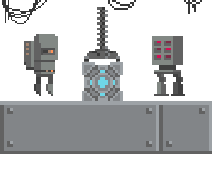
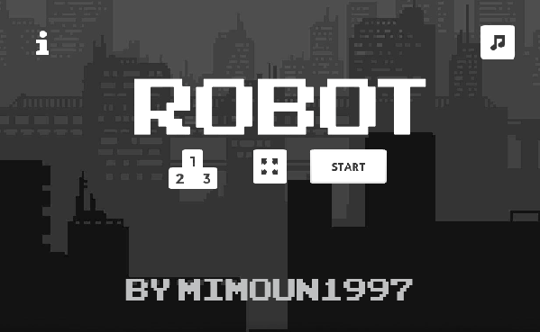

<div align="center">
  <p>
    <h1>
      <a href="https://robot-mimoun1997.netlify.com/">
        
      </a>
      <br />
      Robot
    </h1>
    <h4>2D Platformer game made with Phaser 3</h4>
  </p>
  <p>
    <a href="https://app.netlify.com/sites/robot-mimoun1997/deploys" target="_blank" rel="noopener noreferrer">
      
    </a>
  </p>
</div>

<div align="center">
    <p>
        <h2>Preview</h2>
        
    </p>
</div>

## Index
- [Instal·lació](#insta·lació)
- [Recursos](#recursos)
- [TODO](#todo)

## Insta·lació

```bash
mdkir ~/Code
mdkir mimoun1997
cd mimoun1997/
git clone git@github.com:mimoun1997/robot.git
cd robot
npm install
npm run serve
```

## Recursos

+ Tutorial from [lessmilk](http://www.lessmilk.com/tutorial/great-platformer), <http://www.lessmilk.com/tutorial/2d-platformer-phaser>
+ colors <https://www.lunchboxcode.com/tools/colour-codes/>
+ pass data scenes <http://browsergameshub.com/phaser-3-1-2-passing-data/>
+ phaser 3 examples <https://labs.phaser.io/index.html>
+ phaser 3 docs api <https://photonstorm.github.io/phaser3-docs/>
+ pagina phaser 3 i exemples <http://browsergameshub.com/category/dev-blog/>
+ exemple en typescript https://github.com/jestarray/gate
+ phaser 3 bg music tut https://phasertutorials.com/creating-a-phaser-3-template-part-3/
+ music https://opengameart.org/content/arcade-quarter
+ sprite classes: https://rexrainbow.github.io/phaser3-rex-notes/docs/site/sprite/
+ audio notes: https://rexrainbow.github.io/phaser3-rex-notes/docs/site/audio/
+ tileset and inspiration level from: https://0x72.itch.io/16x16-robot-tileset

## TODO

- [x] background music
- [x] animacions coins
- [x] sound coins, enemy, jump...
- [x] fullscreen
- [x] particles
- [x] tiled
- [x] Game Over
- [x] Game Complete
- [x] Lifes and scores (local high score)
- [x] Control sound (mute on/off)
- [ ] mobile inputs (joystick)
- [ ] 2 levels